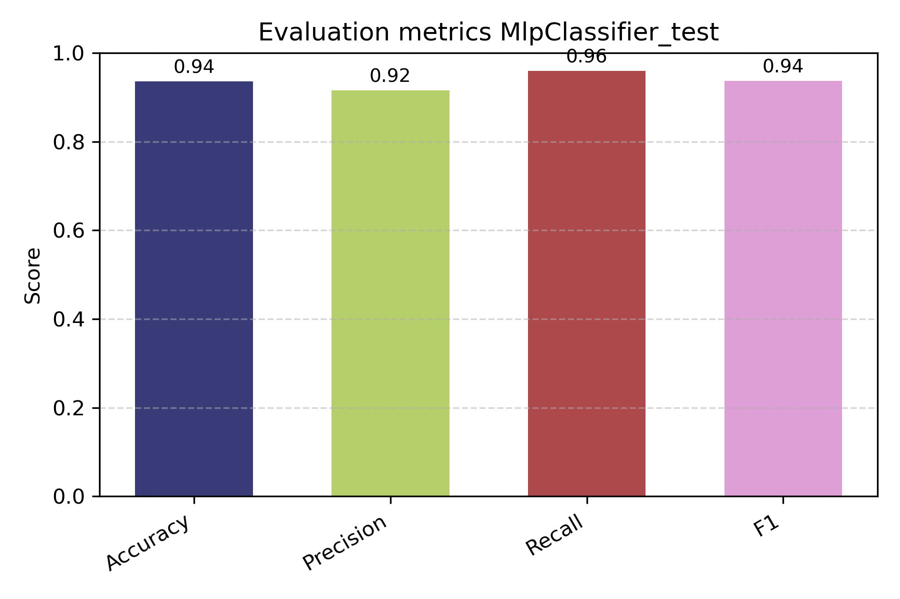

# IA Go Competition – 飆股預測挑戰

**A binary classification challenge to predict “飆股” (high-return stocks) using traditional and deep learning models.**

🔗 [Official Competition Page (T-Brain)](https://tbrain.trendmicro.com.tw/Competitions/Details/38)

---

## 📋 Introduction

This project was developed for the **2025 SinoPac AI GO Competition – “股神對決”**, organized by **永豐金控 (SinoPac Holdings)** in collaboration with the T-Brain platform.

The original dataset had:

- **200,864 rows** and **10,214 columns**
- Highly imbalanced target:
  - Class 0: 199,394
  - Class 1: 1,470

To address this:
- Reduced the dataset to a **balanced subset (2,940 rows)**
- Applied **XGBoost** to identify most relevant features (even those with missing values)
- Performed **KNN imputation** for remaining nulls
- Dropped columns with >30% missing (imputing data in these columns could introduce noise and reduce model performance.)

---

## 🎯 Modeling Pipeline

### ✅ Decision Tree
- Tuned via `RandomizedSearchCV`
- Accuracy: ~0.81 (baseline)

### ✅ Random Forest
- Tuned via `HalvingRandomSearchCV`
- Accuracy: 0.85
- Used for feature importance benchmarking

---

## 🌲 XGBoost Classifier (Optimized)

- Robust to missing values
- Feature selector and classifier
- Cleaned + KNN-imputed dataset

**Metrics (Test Set):**

| Metric     | Score |
|------------|:-----:|
| Accuracy   | 0.93  |
| Precision  | 0.91  |
| Recall     | 0.95  |
| F1-score   | 0.93  |

.png)  
%20Test.png)

---

## 🧠 MLP Classifier (PyTorch, Optimized)

- Built from scratch using PyTorch
- Trained on KNN-imputed + selected features
- Hyperparameters optimized with **Genetic Algorithm (Pygad)**
- Next: add **Cross-Validation**

**Metrics (Test Set):**

| Metric     | Score |
|------------|:-----:|
| Accuracy   | 0.94  |
| Precision  | 0.92  |
| Recall     | 0.96  |
| F1-score   | 0.94  |



---

## 🐳 Docker Portability

The full project is Dockerized:
- Environment based on Conda
- Includes: PyTorch, Scikit-learn, XGBoost, Matplotlib, etc.

### Run Anywhere:

```bash
# 1. Install Docker
sudo apt install docker.io

# 2. Clone repo
git clone https://github.com/your-user/IA_GO.git
cd IA_GO

# 3. Build Docker image
docker build -t ia-go .

# 4. Run with GUI (for plots)
xhost +local:root
docker run --rm -e DISPLAY=$DISPLAY -v /tmp/.X11-unix:/tmp/.X11-unix ia-go

