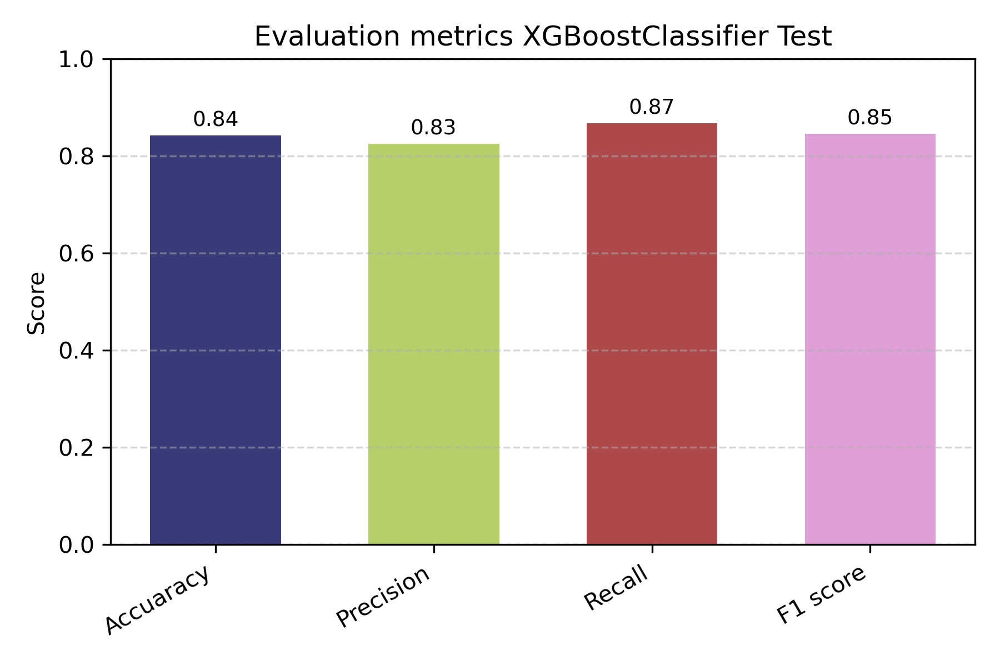
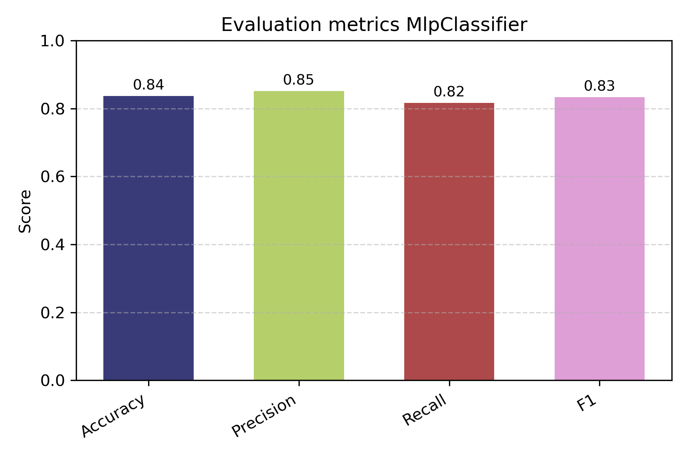

# IA Go Competition

**A binary classification challenge to predict “飆股” (high-return stocks) using traditional and deep learning models.**

---

## 📋 Introduction

This project was developed for the **2025 SinoPac AI GO Competition – “股神對決”**, organized by **永豐金控 (SinoPac Holdings)** in collaboration with the T-Brain platform. The competition challenges participants to design models capable of identifying **high-return stocks (飆股)** based on rich financial datasets containing technical indicators, time-series trends, and baseline tabular features.

To begin, the dataset was balanced to a 1:1 ratio (2,940 samples) and split into three subsets:

1. **Technical Analysis subset** (~30 features)  
2. **Time Series subset** (~465 features)  
3. **Baseline subset** (~905 features)  

This README focuses on our **progressive modeling pipeline**, starting from the Technical Analysis subset and expanding toward more advanced learning architectures.

---

## 🎯 Modeling Strategy

### 📌 Stage 1: Traditional ML (Tree-based)
- **Decision Tree** and **Random Forest** using `RandomizedSearchCV` and `HalvingRandomSearchCV`.
- Feature importance extracted to guide further model design.

### 📌 Stage 2: XGBoost (Robust to Missing Values)
- XGBoost model used to evaluate the relevance of features **even with missing values**.
- If features with high null rates are **not important**, they are dropped.
- If **important but incomplete**, values are **imputed** before passing to later models.

### 📌 Stage 3: Meta-feature Selection Pipeline
- XGBoost is used as a **feature selector** for other classifiers.
- A cleaned and distilled feature set is passed to neural networks.

### 📌 Stage 4: Deep Learning (MLP Classifier)
- A **Multi-Layer Perceptron** (MLP) is implemented using PyTorch.
- Hyperparameters are optimized via **Genetic Algorithms (Pygad)**.
- Next step: add **Cross-Validation** logic to improve generalization.

---

## 📊 Evaluation Results

### ✅ XGBoost Classifier (Feature Selection)

- **Optimizer**: `HalvingRandomSearchCV`
- **Highlights**:
  - Tolerant to missing values
  - Used to rank features and decide between dropping or imputing

| Metric     | Score |
|------------|:-----:|
| Accuracy   | 0.84  |
| Precision  | 0.83  |
| Recall     | 0.87  |
| F1-score   | 0.85  |



---

### ✅ MLP Classifier (Optimized with Genetic Algorithm)

- **Framework**: PyTorch  
- **Hyperparameters optimized**: hidden layers, activation, dropout, init method  
- **Current limitations**: lacks cross-validation (to be added next)

| Metric     | Score |
|------------|:-----:|
| Accuracy   | 0.84  |
| Precision  | 0.85  |
| Recall     | 0.82  |
| F1-score   | 0.83  |



---

## 📦 Portability with Docker

> ✅ **You can now test the model on ANY Linux machine without installing Python, Conda or libraries.**

### 🐳 Instructions to Run Anywhere with Docker

```bash
# 1. Install Docker on the target machine
sudo apt update
sudo apt install -y docker.io
sudo usermod -aG docker $USER
newgrp docker

# 2. Clone or copy this project
git clone https://github.com/your-user/IA_GO.git
cd IA_GO

# 3. Build the Docker image
docker build -t ia-go .

# 4. Run with GUI support (for matplotlib / tkinter)
xhost +local:root  # enable GUI for Docker (only once)
docker run --rm \
    -e DISPLAY=$DISPLAY \
    -v /tmp/.X11-unix:/tmp/.X11-unix \
    ia-go

